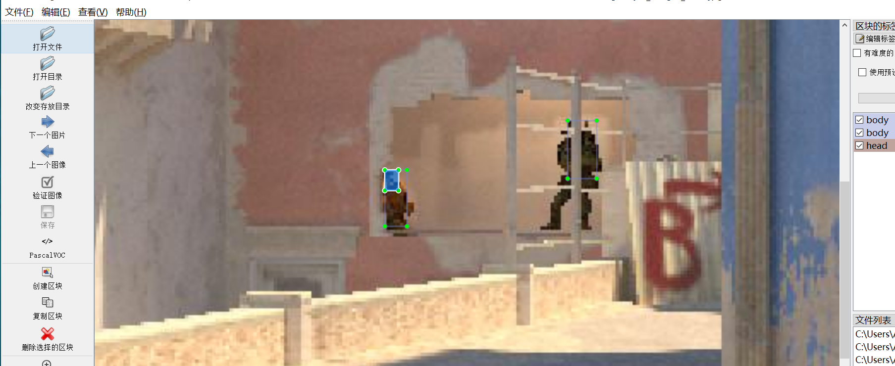
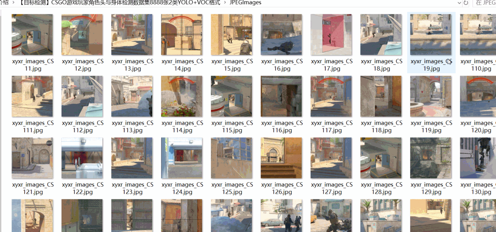
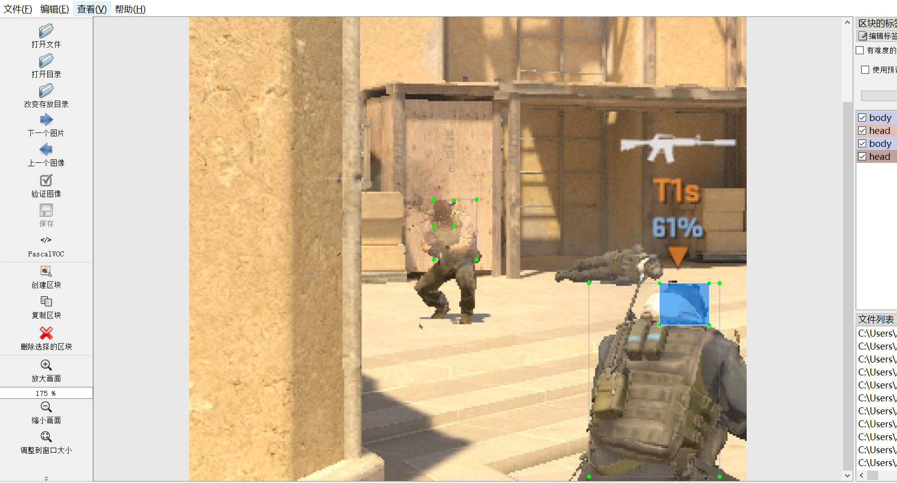

# [Object Detection] CSGO Gamer Corner Color Head and Body Detection Dataset 8888 images2-classYOLO+VOC format

Dataset Format: VOC format + YOLO format

The compressed file contains: three folders, each storing images, xml files, and text files.

Total jpg images in JPEGImages folder: 8888

The total number of XML files in the Annotations folder is 8,888.

The total number of txt files in the labels folder is 8888.

Number of tag types: 2

Tag names: ["body","head"]

The number of boxes for each label (Note that the order of labels in the Yolo format does not correspond to this, but is based on the classes.txt file in the labels folder):

body frame count = 9650

head frame count = 12378

Total boxes: 22028

Picture clarity (Resolution: Pixels): Clear

Is the image enhanced: No

Shape of the label: Rectangular box, used for object detection and recognition.

Dataset Type ：149m

Special Notice: This dataset does not guarantee the accuracy or precision of the trained models or weight files. The dataset only provides accurate and reasonable annotations.

Annotation example:

Image overview:

## Images

---

Here is a pay link on Stripe (https://buy.stripe.com/3cs8yP7sY87d0vu9AB). Please contact me lonlonago@foxmail.com after funding $89, and I will send you a complete data files, thank you!

